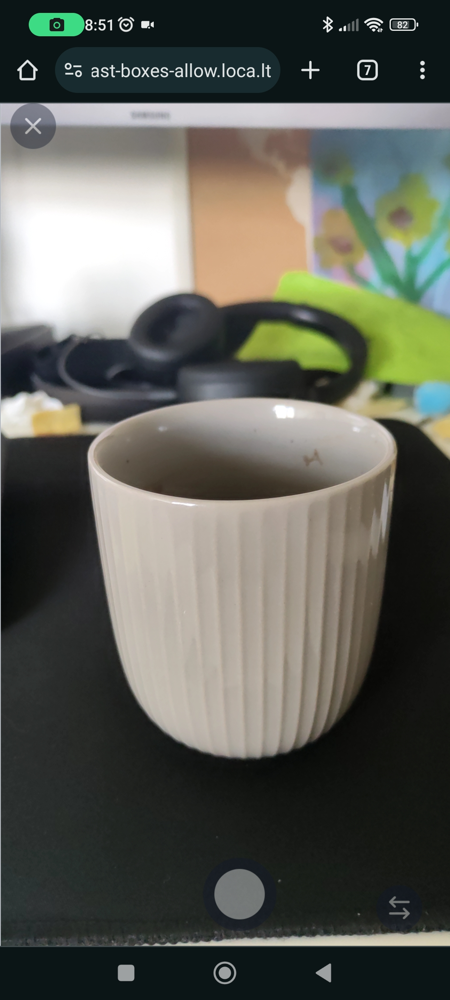
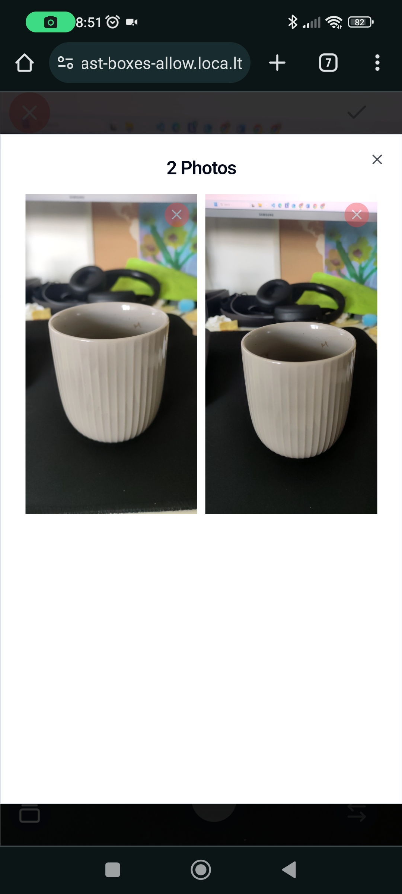
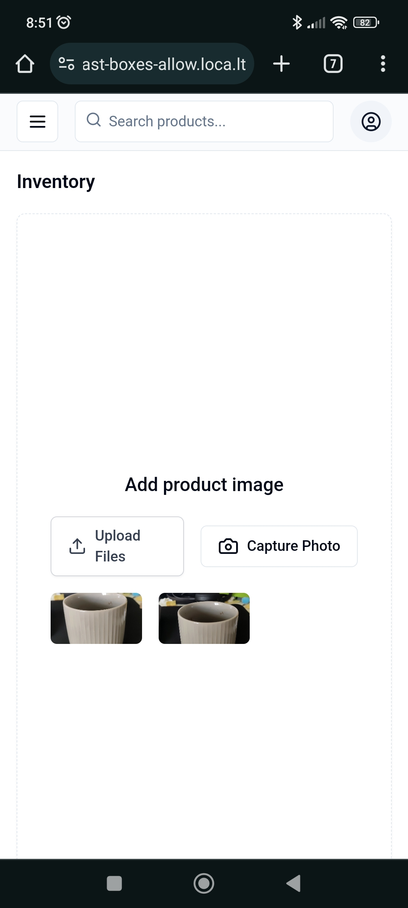

# Capture-Photo Component

The `capture-photo` component is part of a collection of reusable React components designed for direct integration into your applications without the need for installing external packages. This approach ensures that you can fully customize the component according to your project's requirements.

## Philosophy

This component follows the philosophy of not being a traditional component library. It is not available as an npm package. Instead, it is provided for you to copy directly into your project and modify as needed. This encourages a deeper understanding and customization of the components you use without abstracting the functionality into dependency packages.

## Features

- **Browser Compatibility**: Optimized to work across all modern web browsers.
- **Easy Integration**: Easily embeddable into existing React applications with minimal setup.
- **User-Friendly**: Provides a straightforward interface for capturing and handling images, enhancing user engagement.
- **Flexible UI**: Designed with a base style but easily customizable with CSS or styled components.
- **React and TypeScript**: Built using React and TypeScript to ensure type safety and component reusability.

## Ideal Use Cases
- **Profile Photo Updates**: Perfect for applications requiring users to update their profile pictures, such as social networking sites, forums, or any user-centric platforms.
- **Document Scanning**: Useful in scenarios where users need to scan and upload documents directly through the web browser—ideal for banking apps, educational platforms, or administrative portals.
- **Product Image Captures**: Enhances e-commerce platforms by allowing sellers to instantly capture and upload images of products from their devices.
- **Medical Imaging**: Can be used in telehealth applications for patients to send real-time photos of their conditions to healthcare providers.

By integrating the Capture-Photo component, developers can provide their users with powerful, real-time image capture capabilities, directly enhancing the functionality and interactivity of their web applications

## Screenshots

<p align="center">
  
  
  
</p>

## Folder Structure

Here’s a quick overview of the relevant file structure for the `capture-photo` component:

```
/capture-photo
|-- /src
|   |-- /components
|   |   |-- /ui
|   |   |   |-- /camera
|   |   |   |   |-- camera-provider.tsx
|   |   |   |   |-- camera-types.ts
|   |   |   |   |-- camera-view.tsx
|   |   |   |   |-- camera.tsx
```

To ensure the documentation for your `capture-photo` component is comprehensive and guides users effectively through all steps necessary for integration, including the use of the required `CameraProvider`, the "Installation and Setup" section of your README needs to explicitly mention the need to use this provider. Here’s how you can update this section to include detailed instructions about incorporating the `CameraProvider` into a user's project setup.

### Updated Installation and Setup Section for README.md

---

## Installation and Setup

### Step 1: Add Required shadcn-ui Components

Before integrating the `capture-photo` component, add the necessary UI components from shadcn-ui:

```bash
npx shadcn-ui@latest add button
npx shadcn-ui@latest add dialog
npx shadcn-ui@latest add scroll-area
```

### Step 2: Copy the Camera Component

Clone or download the component files into your project directory from the provided code repository, especially from `/src/components/ui/camera`.

### Step 3: Set Up the CameraProvider

The `CameraProvider` is crucial for managing the state and functionality of the camera components. It must wrap your application or the component part that includes the camera functionalities. Add the `CameraProvider` to your project's component hierarchy:

```jsx
// Import the CameraProvider from its location in your project
export default function RootLayout({
  children,
}: {
  children: React.ReactNode;
}) {
  return (
    <html lang="en">
      <body className={`font-sans ${inter.variable}`}>
        <CameraProvider>{children}</CameraProvider>
      </body>
    </html>
  );
}
```

### Step 4: Integration & Customize as Needed

You can modify, style, and extend the components according to your UI and functionality requirements since they are now part of your codebase.

#### Example Usage

This example demonstrates integrating the `Camera` component in an inventory management system to capture product images. Ensure that the `CameraProvider` wraps your `Inventory` component or is higher up in the component tree.

```jsx
import React, { useState } from 'react';
import Camera from "@/components/ui/camera/camera";
import { Dialog, DialogTrigger, DialogContent, Button } from "@/components/ui/dialog";
import { UploadIcon, CameraIcon } from "lucide-react";

function Inventory() {
  const [showDialog, setShowDialog] = useState(false);
  const [capturedImages, setCapturedImages] = useState([]);

  return (
 
      <main className="flex flex-1 flex-col gap-4 p-4 lg:gap-6 lg:p-6">
        <div className="flex items-center">
          <h1 className="text-lg font-semibold md:text-2xl">Inventory</h1>
        </div>
        <div className="flex flex-1 items-center justify-center rounded-lg border border-dashed shadow-sm">
          <div className="flex flex-col items-center justify-center space-y-4 p-8">
            <div className="flex items-center space-x-2">
              <h3 className="text-lg font-medium">Add product image</h3>
            </div>
            <div className="flex items-center justify-center space-x-4">
              <Dialog
                  open={showDialog}
                  onOpenChange={(open) => setShowDialog(open)}
                >
                  <DialogTrigger asChild>
                    <Button variant="outline">
                      <CameraIcon className="mr-2 h-5 w-5" />
                      Capture Photo
                      <span className="sr-only">Capture</span>
                    </Button>
                  </DialogTrigger>
                  <DialogContent className="h-svh w-svw max-w-full p-0">
                    <Camera
                      onClosed={() => {
                        setShowDialog(false);
                      }}
                      onCapturedImages={(images) => {
                        setCapturedImages(images);
                        setShowDialog(false);
                      }}
                    />
                  </DialogContent>
                </Dialog>
            </div>
            {/* Display captured images */}
          </div>
        </div>
      </main>
 
  );
}

export default Inventory;
```

## Community Contributions and Feedback

If you have suggestions for improving the component, including ideas for better naming, please feel free to share.

### Open for Naming Suggestions

The current name, capture-photo, describes the basic functionality but might not capture the full scope or potential of the component. If you have ideas for a name that better reflects its capabilities and use cases, please reach out or submit a pull request with your suggestions. Naming is vital as it not only helps in defining the component's purpose but also enhances its discoverability and usability.

### How to Contribute

1. **Fork the Repository**: Start by forking the repository where the `capture-photo` component is hosted.
2. **Make Your Changes**: Implement your naming suggestions or any other enhancements you think are necessary.
3. **Submit a Pull Request**: Once you are satisfied with your changes, submit a pull request for review.

The component is open-sourced software licensed under the MIT license.
 
